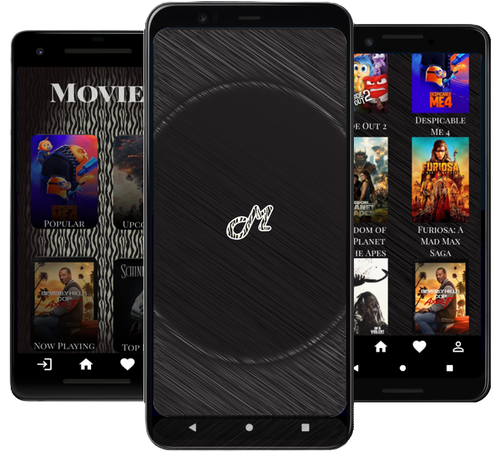

# Movie App (Android)

This is an Android application developed using Kotlin that provides information about movies sourced from The Movie Database (TMDb). Users can explore movies from categories such as popular, upcoming, now playing, and top rated. Additionally, the app allows users to mark movies as favorites for easy access later.

## Features

- **Movie Categories**: Browse movies categorized under popular, upcoming, now playing, and top rated.
- **Movie Details**: View detailed information about each movie, including synopsis, cast, and ratings.
- **Favorites List**: Mark movies as favorites to create a personalized list for quick reference.
- **Offline Access**: Access favorite movies even without an internet connection.

## Technologies Used

- **Language**: Kotlin
- **API**: The Movie Database (TMDb) API for movie information.
- **Persistence**: Local storage for managing favorite movies.

## Getting Started

To run the app locally, follow these steps:

1. **Prerequisites**: Ensure you have Android Studio installed.
2. **Clone**: Clone this repository to your local machine.
3. **API Key**: Obtain an API key from [TMDb](https://www.themoviedb.org/documentation/api) and replace it in the appropriate configuration file.
4. **Run**: Open the project in Android Studio and run the app on an emulator or physical device.

## Contributing

Contributions are welcome! If you have any suggestions or find a bug, please open an issue or create a pull request.

## Acknowledgements

- **TMDb**: For providing the API used in this project.

